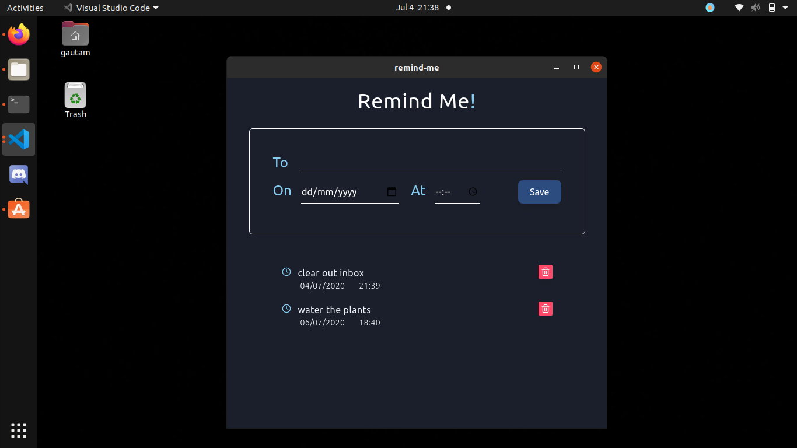
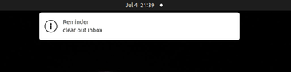

# remind-me

A desktop app for reminders





### Project setup
```
npm install
```

### Quick Start
```
npm run electron
```

### Create App for Windows
```
npm run package-win
```

Find the executable at 

```
./release-builds/remind-me-win32-x64/remind-me.exe
```

### Create App for Linux
```
npm run package-linux && npm run create-debian-installer
```

Find the debain package at 
```
./release-builds/remind-me-linux-x64/remind-me_0.1.0_amd64.deb
```

### To-Do
- [ ] Figure out the source of the huge size of this basic app (56MB :p)
- [ ] Snooze Ability
